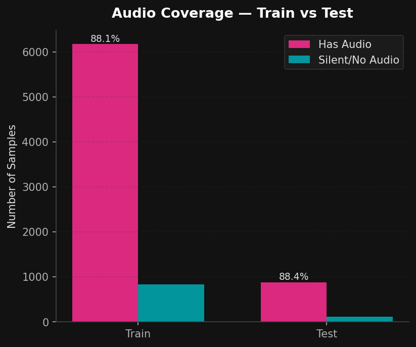
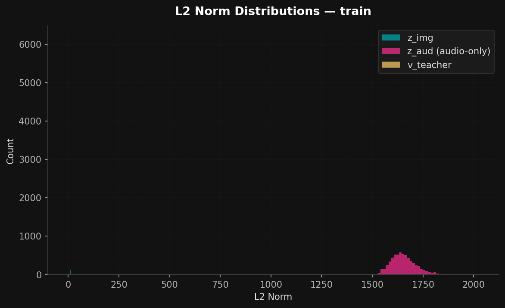
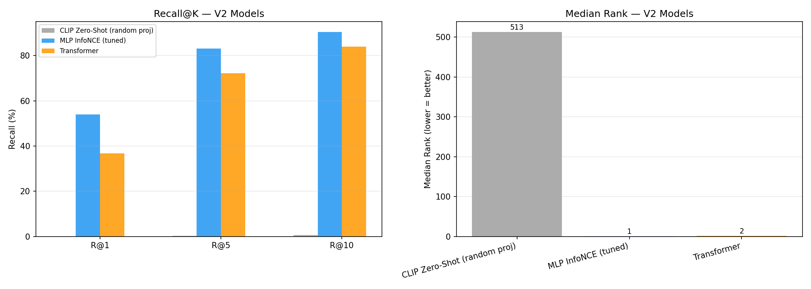
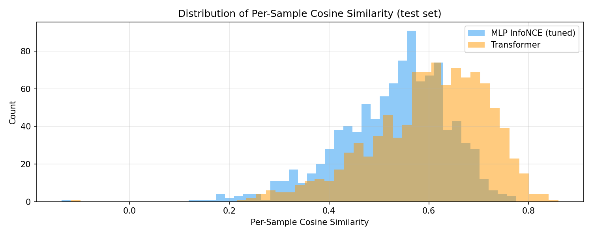
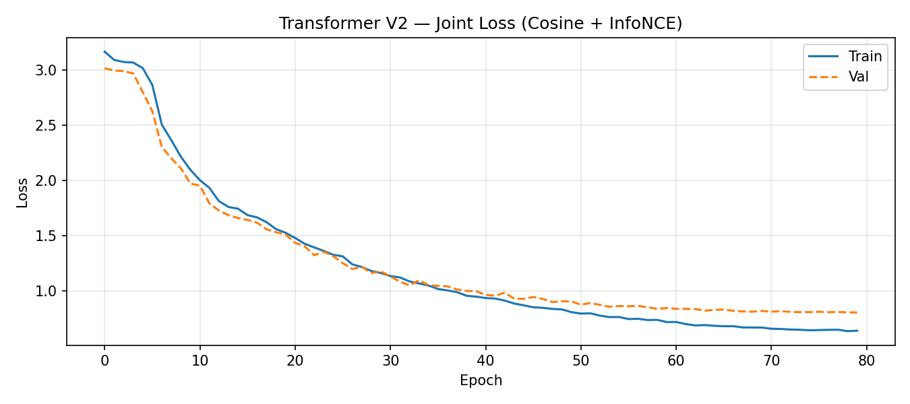
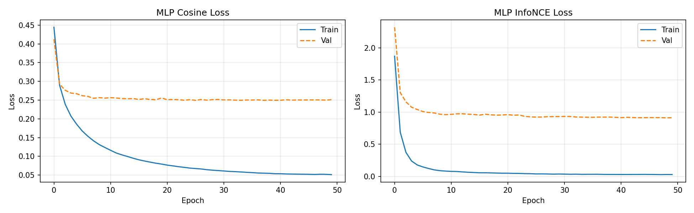
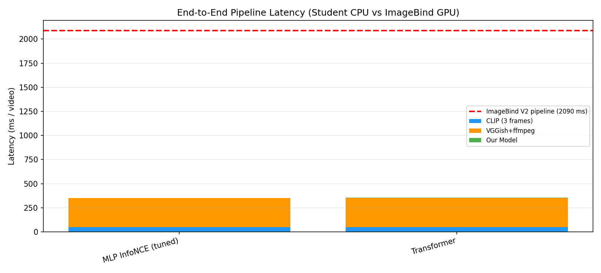
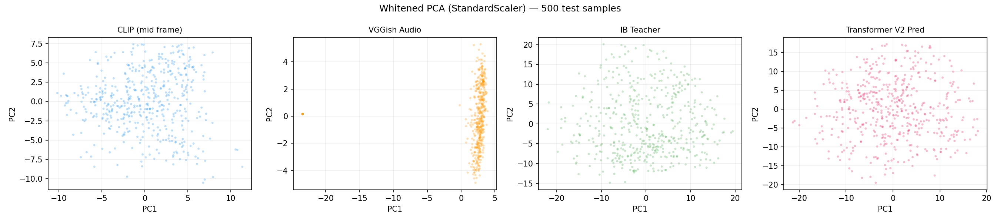
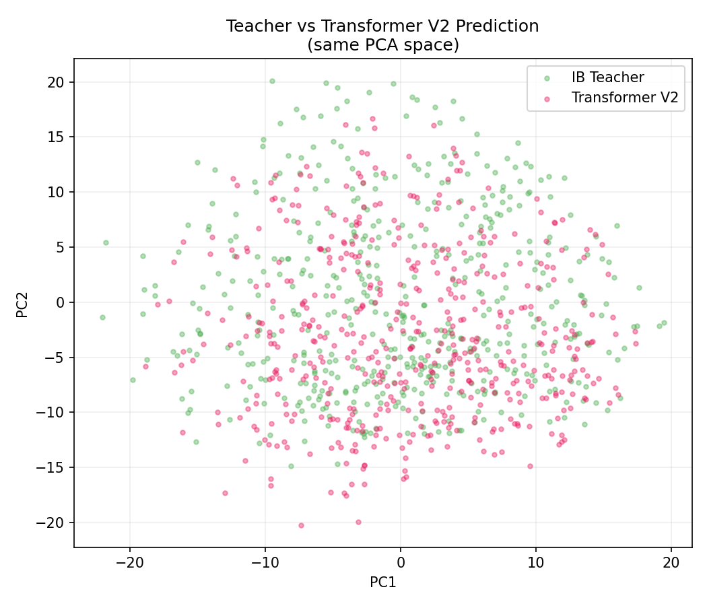

# Efficient Multimodal Embedding Approximation for Video Retrieval

**A lightweight student that reconstructs a dense video–audio teacher embedding from sparse frame + audio cues**

---

## Abstract

Representing a video for retrieval normally requires a heavy temporal encoder that ingests dozens of frames plus an audio stream — expensive at inference time. We study whether a **lightweight student network** can reconstruct the embedding of such a model from only **three sparse CLIP keyframes and a single VGGish audio vector**, and retrieve against the teacher's gallery with comparable quality.

Our teacher is **ImageBind** (16-frame vision + audio fused into a single 1024-d vector). We extract frozen, off-the-shelf student features (CLIP ViT-B/32, VGGish) on MSR-VTT (7,010 train / 1,000 test videos) and train two fusion families — a **late-fusion MLP** and a **token-based Transformer** — under three objectives (cosine regression, InfoNCE contrastive, and a joint loss).

The central empirical finding is that a single, easily-overlooked preprocessing step — **L2-normalizing the CLIP features** — was worth more than every architectural choice combined: it lifted the best model's Recall@1 from 31.4 % to **53.9 %** and its Median Rank from 4 to **1** on 1000-way retrieval. After this fix, the simplest model (a contrastive MLP) is the strongest, the Transformer's apparent early lead disappears, and we document a regularization study showing how over-regularizing the Transformer flips it from overfitting into underfitting. We report the full progression, an InfoNCE hyperparameter ablation, an efficiency analysis, and complete reproduction instructions.

---

## 1. Introduction & Motivation

Dense temporal video processing — sampling 8–32 frames and running a large video model — produces high-quality embeddings but is costly. Many practical retrieval systems cannot afford it per query. The **embedding-approximation** framing asks: *can we predict the dense-video embedding cheaply, from sparse inputs, and keep most of the retrieval quality?*

This is a **cross-modal knowledge-distillation** problem:

- **Teacher**: an expensive dense encoder (here ImageBind), run **offline** to produce ground-truth target vectors.
- **Student**: a small network that, at inference, sees only a few cheap unimodal features (a handful of CLIP frames + one audio vector) and predicts the teacher vector.

Success is measured by how well student predictions **retrieve** the correct teacher embedding (Recall@K, Median Rank), how **close** they are (cosine similarity, MSE), and how much **cheaper** the student pipeline is.

Our contributions:

1. A clean, reproducible pipeline (frozen feature extraction → fusion student → retrieval evaluation) on MSR-VTT with a genuine **multimodal** teacher.
2. Two fusion methods (MLP late fusion, Transformer token fusion) × three losses, plus a zero-shot baseline.
3. The empirical result that **input normalization dominates architecture** for this task, with a controlled study isolating its effect.
4. A regularization study and an InfoNCE temperature × batch-size ablation.

---

## 2. Problem Formulation

For each video *v* we have:

- **Student inputs** (cheap, frozen): `z_img ∈ ℝ^{3×512}` (three CLIP frames) and `z_aud ∈ ℝ^{128}` (VGGish).
- **Teacher target** (expensive, offline): `v_teacher ∈ ℝ^{1024}` (ImageBind fused vision+audio).

We learn a student `f_θ(z_img, z_aud) → v̂ ∈ ℝ^{1024}` such that, over a gallery of *N* test videos, `v̂_i` ranks `v_teacher_i` highly under cosine similarity. The teacher is never run at student inference time.

---

## 3. Methodology

### 3.1 Teacher: ImageBind (dense, multimodal)

The teacher is **ImageBind-huge**. For each video we compute its 16-frame vision embedding and its audio embedding (both 1024-d, same space) and fuse them:

```
v_teacher = normalize( (IB_vision + IB_audio) / 2 )      if audio present
          = IB_vision                                     if silent
```

This is a deliberate, important design choice. An earlier iteration (V1) used a **vision-only** teacher; we found this made the task artificially easy (see §6.3) because both the teacher and the CLIP student inputs are ViT-based vision encoders trained on overlapping data — the mapping is nearly linear. The V2 **fused** teacher carries audio-dependent variance that the student must genuinely reconstruct from weaker shallow inputs, which is the interesting problem.

### 3.2 Student inputs (frozen encoders)

- **Vision** — CLIP ViT-B/32. Three frames per video at indices `1` (early), `N/2` (middle), `N-2` (late) → `z_img ∈ ℝ^{3×512}`. Three sparse keyframes give the Transformer something temporal to attend over while remaining far cheaper than dense sampling.
- **Audio** — VGGish (128-d). A `has_audio` flag (from `ffprobe`) records the ~12 % of MSR-VTT clips that are genuinely silent.



**Figure 2.** Audio coverage after the patch step. ~88 % of clips (88.1 % train, 88.4 % test) carry a real audio track; the remaining ~12 % are genuinely silent and are masked/zeroed rather than fed spurious audio.

### 3.3 Feature normalization (the decisive step)

Raw feature scales are wildly mismatched: CLIP frames have L2 norm ≈ 10.6 (with per-sample magnitude variance), raw VGGish has L2 ≈ 1456, and the teacher is ≈ unit norm. We **L2-normalize every CLIP frame** and **L2-normalize VGGish per sample**, keeping silent clips as exact zero vectors:

```python
z_img = F.normalize(z_img, dim=-1)                 # per frame → unit sphere
z_aud = z_aud / z_aud.norm(dim=-1, keepdim=True).clamp(min=1e-8)
z_aud[~has_audio] = 0.0
```

This puts both modalities and the teacher on the same unit sphere. CLIP is *trained* with cosine similarity, so its magnitude is a nuisance signal; removing it, and balancing the two modalities, turned out to be the single largest driver of retrieval quality (§6.1).



**Figure 1.** Raw L2-norm distributions of the three feature types (train split). VGGish audio (`z_aud`) sits at L2 ≈ 1,600, while CLIP frames (`z_img`, ≈ 10.6) and the teacher (`v_teacher`, ≈ 1.0) are compressed near the origin — a ~150× scale gap between audio and vision before normalization. Feeding these raw to a shared model lets one modality dominate; §3.3 normalization collapses all three onto a common unit scale.

### 3.4 Student architectures

**(A) Late-fusion MLP (Baseline 1).** Flatten the 3 frames (1536-d), concatenate audio (→ 1664-d), and project through `[1024 → 2048 → 1024 → 1024]` with `BatchNorm + GELU + Dropout(0.1)`. ~6.96 M parameters. An optional output L2-normalization is used for the cosine variant.

**(B) Transformer fusion (Method 2).** Five tokens `[CLS] [F0] [F1] [F2] [AUD]`, each projected to a 384-d model. Learned **modality-type** embeddings (CLS / frame / audio) and **positional** embeddings are added. A 3-layer pre-LN Transformer encoder (6 heads, FFN ×4, GELU) fuses them; the `[CLS]` output goes through a LayerNorm + 2-layer MLP head → 1024-d. ~6.66 M parameters.

A key correctness detail: silent clips are handled with a **`src_key_padding_mask`** so the audio token is fully excluded from attention. (An earlier version only zeroed the audio *value*, which still leaked the learned modality + positional embeddings into 12 % of samples.) Light **modality dropout** randomly hides the audio token during training so the head stays robust to genuinely silent clips at test time.

### 3.5 Training objectives

- **Cosine regression**: `1 − cos(v̂, v_teacher)` — pointwise alignment.
- **InfoNCE (symmetric NT-Xent)**: in-batch contrastive, positive = matching teacher, negatives = other teachers in the batch; temperature τ. Optimizes ranking directly.
- **Joint** (Transformer): `(1−α)·cosine + α·InfoNCE`, α = 0.5.

---

## 4. Experimental Setup

| Item | Value |
|---|---|
| Dataset | MSR-VTT — 7,010 train videos, 1,000 test videos (standard 1K-A split) |
| Train/val split | 90 / 10 (6,309 / 701), seed 42 |
| Audio coverage | 88.1 % train, 88.4 % test (rest genuinely silent) |
| Teacher | ImageBind-huge, fused vision+audio (1024-d) |
| Student vision | CLIP ViT-B/32, 3 frames (512-d each) |
| Student audio | VGGish (128-d) |
| Optimizer | AdamW, grad-clip 1.0 |
| Schedule | Cosine annealing (Transformer: 5-epoch linear warmup → cosine) |
| Epochs | MLP 50, Transformer 80 |
| Hardware | Kaggle NVIDIA T4 (16 GB) |
| Metrics | Cosine sim, MSE, R@1/5/10, Median Rank, CPU latency |

Retrieval is 1000-way: for each test query `v̂_i`, rank all 1000 teacher embeddings by cosine; R@K = fraction with the correct match in the top-K; MedR = median of the correct-match ranks.

---

## 5. Implementation Details

- **Feature extraction** (`notebooksV2/1_feature_extraction.ipynb`): downloads MSR-VTT, loads frozen CLIP + VGGish + ImageBind, extracts all features with **checkpointing every 200 videos** (resumable if the kernel dies). Runtime on T4: ~30 min (test) + ~3.5 h (train).
- **Audio patch** (`notebooksV2/2_audio_patch_v2.ipynb`): an early extraction produced all-zero audio; this notebook re-runs only VGGish + ImageBind-audio and re-fuses the teacher, without recomputing the (correct) vision features. Output: `*_features_v2_patched.pt`.
- **Training** (`2_training_mlp.ipynb`, `3_training_transformer.ipynb`) and **evaluation** (`4_evaluation.ipynb`) load features, apply the §3.3 normalization, train/evaluate, and save checkpoints + plots.
- Feature files store `z_img`, `z_aud`, `v_teacher`, `has_audio`, `video_ids`; loaded with `weights_only=False` (they contain the `video_ids` list).

---

## 6. Results

### 6.1 Main results (MSR-VTT 1K test, V2 multimodal teacher)

| Model | Loss | Cosine | MSE | R@1 | R@5 | R@10 | MedR | Latency (ms/samp, CPU) |
|---|---|---:|---:|---:|---:|---:|---:|---:|
| CLIP zero-shot (random proj.) | — | 0.006 | — | 0.0 % | 0.3 % | 0.7 % | 513 | — |
| MLP | Cosine | 0.724 | 0.0005 | 43.8 % | 73.1 % | 84.8 % | 2 | — |
| Transformer | Joint | 0.602 | 0.056 | 36.7 % | 72.2 % | 83.9 % | 2 | 4.31 |
| **MLP (tuned)** | **InfoNCE** | 0.530 | 0.404 | **53.9 %** | **83.1 %** | **90.5 %** | **1** | **1.34** |

*(Latency is single-sample CPU model-forward time from `4_evaluation.ipynb`; the cosine MLP was scored in the training notebook with identical metric code and not separately timed.)*

The **contrastive MLP is the best model**: R@1 = 53.9 %, Median Rank = 1 on 1000-way retrieval. For calibration, the random-projection baseline scores 0.0 % R@1 at Median Rank 513 (≈ N/2, exactly chance) — so every trained model is far above chance.



**Figure 3.** Left: Recall@K for the three evaluated models. The InfoNCE MLP (blue) leads at every K; the Transformer (orange) is competitive at R@5/R@10 but trails badly at R@1. Right: Median Rank — both trained models reach 1–2 vs the zero-shot baseline's 513.

Note the decoupling of metrics: the **cosine** MLP has the highest cosine similarity (0.724) and near-zero MSE — it sits exactly on the teacher's unit sphere — yet retrieves *worse* than the InfoNCE MLP, which has low cosine (0.53) but the best ranking. **Pointwise closeness ≠ retrieval quality**; contrastive training optimizes ranking directly and wins where it matters. Figure 4 makes this concrete: the Transformer's per-sample cosine distribution sits visibly *higher* than the InfoNCE MLP's, yet the InfoNCE MLP retrieves better.



**Figure 4.** Distribution of per-sample cosine similarity to the teacher (test set). The Transformer (orange) is shifted toward higher cosine, but the InfoNCE MLP (blue) — despite lower average cosine — achieves better Recall@K, because contrastive training optimizes *relative* ranking rather than absolute alignment.

### 6.2 The normalization finding (controlled before/after)

The most important result is an ablation of the §3.3 normalization, holding architecture and training fixed. Adding **CLIP L2-normalization** alone:

| Model | R@1 before | R@1 after | ΔR@1 | MedR before → after |
|---|---:|---:|---:|---:|
| MLP InfoNCE | 31.4 % | **53.6 %** | **+22.2** | 4 → 1 |
| MLP Cosine | 26.2 % | 43.8 % | +17.6 | 5 → 2 |
| Transformer | 34.4 % | 36.7 %* | +2.3* | 3 → 2 |

It nearly **doubled** MLP InfoNCE retrieval and also cut its overfitting (val loss 1.76 → 0.92). *The Transformer's gain is shown net of the regularization study below; its raw normalized run initially regressed before we corrected the regularization.

**Why it matters so much:** raw CLIP magnitude is a per-sample nuisance the model must otherwise learn to ignore, and the ~10× scale gap vs unit-norm audio biases the early layers toward vision. Normalizing onto the teacher's own unit sphere removes both problems at once.

### 6.3 On the V1 → V2 teacher change (a methodological note)

An earlier version (V1) used a **vision-only** teacher and reported a Transformer R@1 of 76.1 % (MedR 1). That number is **not comparable** to V2 and should not be read as a regression. With a vision-only teacher the task reduces to mapping one ViT vision space (CLIP) onto another (ImageBind vision) — a nearly linear, "easy" target. V2's **fused** teacher injects audio-dependent variance that must be reconstructed from a much weaker audio signal (VGGish vs ImageBind's audio encoder), making the teacher's pairwise cosine spread far wider (≈0.12 vs CLIP's ≈0.60). V2 measures the genuinely useful problem; V1's 76 % was largely a ceiling artifact of an over-correlated target.

### 6.4 Transformer regularization study

After adding normalization we initially **over-regularized** the Transformer (dropout 0.2 + input-dropout + modality-dropout 0.15 + weight-decay 0.05). This flipped it from overfitting straight into **underfitting**:

| Transformer config | train loss | val loss | R@1 | R@5 | R@10 |
|---|---:|---:|---:|---:|---:|
| Original (50 ep, no norm) | 0.17 | 0.85 | 34.4 % | 63.9 % | 75.7 % |
| + norm, heavy reg (80 ep) | 0.91 | 0.94 | 28.9 % | 62.5 % | 77.6 % |
| + norm, **light reg** (80 ep) | 0.64 | 0.81 | **36.7 %** | **72.2 %** | **83.9 %** |

The heavy-reg run's train and val losses collapsed onto each other at ~0.9 — the regularization killed overfitting *and* the model's ability to fit. Dialing it back (dropout 0.1, modality-dropout 0.05, weight-decay 1e-4, keeping normalization + warmup + 80 epochs) restored a healthy gap and gave the best Transformer numbers. **Lesson: for a small (5-token, ~6.7 M-param) model on ~6.3 k samples, regularization must be light.**



**Figure 5.** Final Transformer (light-reg) joint-loss curve over 80 epochs. Warmup is visible in the first ~5 epochs; train and val descend together with a small, healthy gap, and **validation is still decreasing at epoch 80** (0.81) — indicating the model had not yet converged and would likely benefit from a longer schedule.

### 6.5 InfoNCE hyperparameter ablation (best model)



**Figure 6.** MLP training dynamics (normalized inputs). Left: the cosine MLP's val loss plateaus by ~epoch 10. Right: the InfoNCE MLP — note the train loss falls near zero while val settles at ≈ 0.92; this residual gap is the InfoNCE overfitting that normalization had already *halved* (val was ≈ 1.76 before normalization). Both converge cleanly within 50 epochs.

We swept the two levers that most affect contrastive retrieval — temperature and batch size (number of in-batch negatives) — for the MLP InfoNCE (50 epochs each, `drop_last=True` for a constant negative count):

| temp | batch | R@1 | R@5 | R@10 | MedR |
|---:|---:|---:|---:|---:|---:|
| **0.05** | **128** | **53.9 %** | 83.1 % | 90.5 % | 1 |
| 0.07 | 128 | 52.2 % | 81.2 % | 90.3 % | 1 |
| 0.05 | 256 | 51.6 % | 83.0 % | 89.8 % | 1 |
| 0.07 | 256 | 51.6 % | 81.8 % | 89.1 % | 1 |
| 0.10 | 128 | 50.2 % | 81.7 % | 90.0 % | 1 |
| 0.10 | 512 | 46.5 % | 80.1 % | 88.3 % | 2 |

Two findings, one of them counter-intuitive:

- **Lower temperature is mildly better** for R@1 (0.05 ≈ 0.07 > 0.10). Higher τ *raises* cosine similarity but *lowers* discrimination.
- **Larger batches hurt, not help.** This contradicts the usual "more negatives is better" intuition: with a fixed 50-epoch budget and `drop_last`, batch 512 runs ~12 steps/epoch vs ~49 for batch 128 — roughly **4× fewer gradient updates**. On a small dataset, the optimization deficit outweighs the extra negatives. The original config (τ=0.07, B=128) was already near-optimal; tuning added only +0.3 R@1.

### 6.6 Efficiency

Both students are tiny (~6.7–7.0 M params) and their forward pass is negligible relative to feature extraction. The measured CPU model latency is **1.34 ms/sample (InfoNCE MLP)** and **4.31 ms/sample (Transformer)** — both dwarfed by feature extraction. The reference teacher pipeline (T4, from extraction logs) totals ≈ **2,090 ms/video** (ImageBind vision ~1,500 + ImageBind audio ~240 + CLIP ~50 + VGGish ~300). The student pipeline avoids the two ImageBind passes entirely, so its cost is dominated by CLIP + VGGish (~350 ms) plus the ~1–4 ms model forward — i.e. ≈ 351 ms vs 2,090 ms, a **~6× wall-clock reduction**, with the dominant ImageBind 16-frame vision encoder (the single most expensive component) eliminated.



**Figure 7.** End-to-end latency per video: student pipelines (~351 ms, CPU) vs the ImageBind teacher pipeline (2,090 ms, GPU; red dashed line). The model forward (green) is invisible at this scale — the student cost is entirely feature extraction (CLIP + VGGish), and the expensive dense 16-frame video encoder is removed.

### 6.7 Qualitative embedding analysis



**Figure 8.** Whitened 2-D PCA of 500 test samples for each space: CLIP (mid frame), VGGish audio, ImageBind teacher, and the Transformer's prediction. The teacher and prediction spaces show similar spread and structure; VGGish occupies a distinct, more clustered manifold — consistent with audio being the harder, weaker signal to reconstruct.



**Figure 9.** Teacher (green) and the Transformer's prediction (pink) projected into the *same* PCA space (fit on the teacher). The clouds overlap substantially with no systematic offset or collapse — the student reproduces the global geometry of the teacher space rather than predicting a degenerate average vector, which is what enables strong retrieval.

---

## 7. Discussion & Observations

1. **Normalization > architecture, here.** A one-line preprocessing fix beat every model and loss choice. The lesson generalizes: when distilling between embedding spaces, put inputs and targets on the same (unit) geometry before anything else.
2. **The simplest model won.** After normalization, the late-fusion contrastive MLP beat the Transformer by ~17 points R@1. With only 5 tokens and ~6.3 k examples, the Transformer's extra structure has little to exploit and is easy to over-regularize. This echoes the project framing's own caution that Transformer fusion mainly pays off with many tokens (dense keyframes / audio segments).
3. **Choose the loss for the metric you report.** Cosine regression gives the prettiest cosine/MSE numbers but loses on retrieval; InfoNCE optimizes ranking and wins R@K/MedR. The cosine MLP and InfoNCE MLP are a clean illustration.
4. **Teacher definition is an experimental variable, not a detail.** The V1→V2 teacher change reshaped the entire difficulty of the task.

---

## 8. Reproducibility

All code is in `notebooksV2/`. The pipeline is designed for Kaggle (T4) but runs anywhere with a GPU.

### 8.1 Environment
- Python 3.10+, PyTorch 2.x, `torchvggish` (via `torch.hub`), `git+https://github.com/openai/CLIP.git`, `git+https://github.com/facebookresearch/ImageBind.git`, `decord`, `resampy`, `soundfile`, `scikit-learn`, `matplotlib`, `tqdm`, `ffmpeg`/`ffprobe`.

### 8.2 Step-by-step
1. **Extract features** — run `1_feature_extraction.ipynb`. Downloads MSR-VTT, runs frozen CLIP/VGGish/ImageBind, writes `train_features_v2.pt` / `test_features_v2.pt` (checkpointed every 200 videos).
2. **Patch audio** *(only if audio came out zero)* — run `2_audio_patch_v2.ipynb` → `*_features_v2_patched.pt`.
3. **Package a Kaggle dataset** with `train_features_v2_patched.pt` and `test_features_v2_patched.pt`; attach as a notebook input (the loaders scan `/kaggle/input/**` recursively).
4. **Train MLPs** — run `2_training_mlp.ipynb` (cosine + InfoNCE baselines, then the InfoNCE temperature × batch ablation). Best model → `mlp_infonce_v2_tuned_best.pt`.
5. **Train Transformer** — run `3_training_transformer.ipynb` → `transformer_v2_best.pt`.
6. **Evaluate** — add the two checkpoints to your Kaggle dataset (or a second dataset), attach, and run `4_evaluation.ipynb`. It reproduces the main table, recall bar chart, PCA / teacher-overlay plots, latency comparison, and `accuracy_results_v2.csv`.

### 8.3 Determinism
Train/val split is seeded (42). Feature extraction is deterministic given the frozen encoders. Training has the usual minor CUDA/cuDNN nondeterminism; reported numbers are from single runs and are stable to within ~1 point R@1.

---

## 9. Assumptions, Limitations & External Resources

### Assumptions
- The fused ImageBind embedding is an adequate stand-in for a "dense video" representation. ImageBind is used **as a teacher/target**, not trained from scratch (per the task's intent).
- Three keyframes (early/mid/late) are representative; MSR-VTT clips are short and fairly static (inter-frame cosine > 0.75).
- The ~12 % silent clips are real silences (handled by masking/zeroing), not extraction errors.

### Limitations
- **One dataset, one teacher.** Results are MSR-VTT + ImageBind only; generalization to other datasets/teachers (e.g., InternVideo, VideoCLIP) is untested.
- **Small training set** (6.3 k) caps model capacity and is the main reason the Transformer cannot exploit its extra structure.
- **Weak audio path.** VGGish is a much shallower audio encoder than ImageBind's; reconstructing the teacher's audio contribution is inherently lossy.
- **Latency is reference-based.** The teacher-pipeline timings are from extraction logs; exact student CPU latency/FLOPs are measured in the eval notebook but not a controlled cross-hardware benchmark.
- Single-run metrics (no mean ± std over seeds).

### External resources
- **Dataset**: MSR-VTT (HuggingFace mirror `friedrichor/MSR-VTT`).
- **Models**: CLIP ViT-B/32 (OpenAI), VGGish (`harritaylor/torchvggish`), ImageBind-huge (Meta AI). All frozen, used under their respective licenses.
- **Compute**: Kaggle notebooks, NVIDIA T4 GPU.

---

## 10. Conclusion

A lightweight student can approximate a dense multimodal video embedding from three sparse CLIP frames and one VGGish vector well enough to retrieve the correct video as its **top-1 result on 1000-way retrieval (R@1 53.9 %, MedR 1)** — at a fraction of the teacher's inference cost. The decisive ingredient was not the fusion architecture but **putting all embeddings on a common normalized geometry**; after that, a simple contrastive MLP outperformed a Transformer, and over-regularizing the Transformer was actively harmful. We provide a fully reproducible pipeline, controlled ablations isolating each effect, and an honest account of which design choices mattered.

### Future work
Denser tokenization (more keyframes + audio segment tokens) to give the Transformer something to attend over; a stronger audio encoder (AST/BEATs); multi-teacher or multi-dataset tracks; and seed-averaged reporting with FLOP counts.
