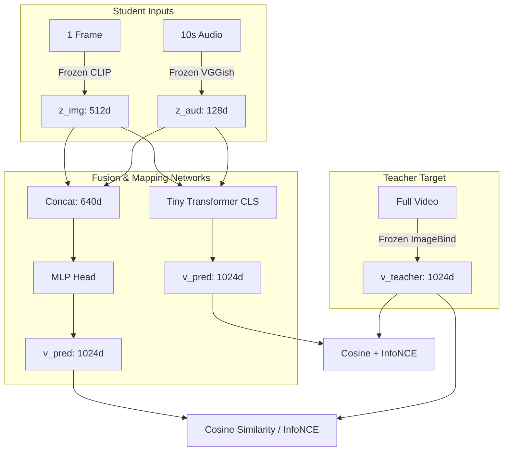

# Audio-Visual Approximation of Video Semantic Space: Kaggle Setup & Model Implementation Plan

This plan details how we will set up the local development environment in this workspace, connect it to Kaggle's free GPU instances, and implement the multimodal embedding approximator.

---

## User Review Required

> [!IMPORTANT]
> **Kaggle Setup Prerequisites**:
> To execute notebooks on Kaggle's GPU, we need to establish a connection between your local editor/environment and the Kaggle interactive session. Please follow the steps below to start the server and share the connection URL.
>
> 1. **Start Kaggle Session**:
>    - Log in to Kaggle and open a new/existing Notebook.
>    - In the right-hand panel (Settings), under **Accelerator**, select **GPU T4 x2** or **GPU P100**.
>    - In the top menu, go to **Run** $\rightarrow$ **Kaggle Jupyter Server** and click **Start Session**.
> 2. **Copy the URL**:
>    - Copy the connection URL provided (it usually looks like `http://localhost:8080/?token=...` or has a custom Kaggle URL structure).
>    - **Provide this URL to me** in your next response so I can configure local automation if needed, and connect to the remote server.
> 3. **Local VS Code Setup**:
>    - Ensure you have the **Jupyter Extension** installed in VS Code.
>    - Open a Jupyter Notebook file (`.ipynb`), click on **Select Kernel** (top-right), choose **Existing Jupyter Server**, and paste the copied URL.

> [!WARNING]
> **File Syncing & Persistence**:
> Files saved on Kaggle's active container (under `/kaggle/working`) are **temporary** and will be deleted once the interactive session times out (typically after 60 minutes of idle time or 12 hours max).
> - We will write code to **automatically serialize and download** the extracted features and trained model weights to your local workspace (`d:/Multimodal-approximator/data/` and `d:/Multimodal-approximator/models/`) programmatically from the notebooks.
> - This ensures no progress is lost when the Kaggle session expires.

---

## Open Questions

> [!IMPORTANT]
> 1. **MSR-VTT Dataset Source**: Do you have the MSR-VTT dataset already downloaded, or should we write code to download it directly inside the Kaggle environment? (Downloading on Kaggle is recommended as it uses Kaggle's high-speed internet and does not consume your local bandwidth).
> 2. **Kaggle API Credentials**: Do you have a `kaggle.json` API token? If yes, we can use it to programmatically download MSR-VTT or upload/download weights.
> 3. **Teacher Model Selection**: We suggest using **ImageBind** as the teacher (generating 1024-dim target video embeddings). If ImageBind is too slow, we can fall back to a standard video encoder like VideoCLIP or a multi-frame ViT. Are you aligned with using ImageBind?

---

## Proposed Changes

We will create a structured python and Jupyter environment in the workspace.

### [NEW] Local Environment Configuration

#### [NEW] [requirements.txt](file:///d:/Multimodal-approximator/requirements.txt)
Define local Python dependencies for managing notebooks, connecting to remote kernels, and running local scripts.
```txt
jupyter
notebook
ipykernel
requests
websocket-client
numpy
torch
torchvision
tqdm
pandas
matplotlib
```

### [NEW] Repository Structure

We will organize the code into modular source files and sequential Jupyter notebooks.

```
d:/Multimodal-approximator/
├── requirements.txt
├── src/
│   ├── __init__.py
│   ├── models.py       # MLP and Tiny Transformer architectures
│   ├── loss.py         # InfoNCE contrastive loss module
│   ├── metrics.py      # Recall@K and MedR calculations
│   └── dataset.py      # PyTorch Dataset for loading cached embeddings
└── notebooks/
    ├── 1_feature_extraction.ipynb  # Download MSR-VTT, run CLIP/VGGish/ImageBind, and cache features
    ├── 2_training_mlp.ipynb         # Train Baseline 1 (MLP + Cosine) and Method A (MLP + InfoNCE)
    ├── 3_training_transformer.ipynb # Train Method B (Tiny Transformer + Cosine/InfoNCE)
    └── 4_evaluation.ipynb           # Compare latency, params, and retrieval metrics (Recall@K, MedR)
```

---

## Architectural & Model Specification



### 1. Feature Extraction (Notebook 1)
- **Visual Frame Encoder**: CLIP `ViT-B/32` (Frozen) $\rightarrow$ Outputs 512-dim embedding per keyframe.
- **Audio Encoder**: VGGish (Frozen) $\rightarrow$ Outputs 128-dim embedding per audio segment.
- **Teacher Video Encoder**: ImageBind (Frozen) $\rightarrow$ Outputs 1024-dim embedding for the full video sequence.
- **Output Caching**: Extract features for train/val/test splits and serialize them as dictionary tensors (`train_features.pt`, `val_features.pt`, `test_features.pt`).

### 2. Baseline & Proposed Models (Notebooks 2 & 3)
- **Baseline 1 (MLP + Cosine Loss)**:
  - Concatenates $z_{img}$ (512-dim) and $z_{aud}$ (128-dim) $\rightarrow$ 640-dim.
  - Multi-Layer Perceptron (MLP) with 2 hidden layers (512, 1024) and ReLU activations.
  - Loss: $L_{cos} = 1 - \text{cosine\_similarity}(v_{pred}, v_{teacher})$.
- **Method A (MLP + InfoNCE Loss)**:
  - Same MLP architecture as Baseline 1.
  - Trained with InfoNCE loss to optimize cross-modal alignment within the batch:
    $$L_{InfoNCE} = -\log \frac{\exp(\text{sim}(v_{pred}^i, v_{teacher}^i) / \tau)}{\sum_{j} \exp(\text{sim}(v_{pred}^i, v_{teacher}^j) / \tau)}$$
- **Method B (Tiny Transformer Fusion)**:
  - Treat $z_{img}$ and $z_{aud}$ as separate input tokens, projected to 256-dim.
  - Prepend a learnable `[CLS]` token.
  - 2-layer Transformer encoder (4 attention heads, feedforward dim 512).
  - Project the output `[CLS]` token to 1024-dim.
  - Loss: Joint $L_{cos} + \lambda L_{InfoNCE}$.

---

## Verification Plan

### Automated Verification
1. **Local Setup Verification**:
   - Run `pip install -r requirements.txt` locally.
   - Run a python script to check PyTorch version and verify Kaggle Jupyter connection URL matches standard patterns.
2. **Feature Alignment Test**:
   - Extract embeddings from a single toy video file.
   - Assert dimensions: `z_img.shape == (512,)`, `z_aud.shape == (128,)`, `v_teacher.shape == (1024,)`.
3. **Retrieval Metric Validation**:
   - Run dummy tensors through `src/metrics.py` to confirm Recall@1/5/10 and Median Rank return mathematically correct results.

### Manual Verification
1. **Remote Execution Check**:
   - Run a short cell on the connected Kaggle server to verify GPU access (`torch.cuda.is_available()`).
   - Check that output directories `/kaggle/working/data` are created and files can be downloaded programmatically.
