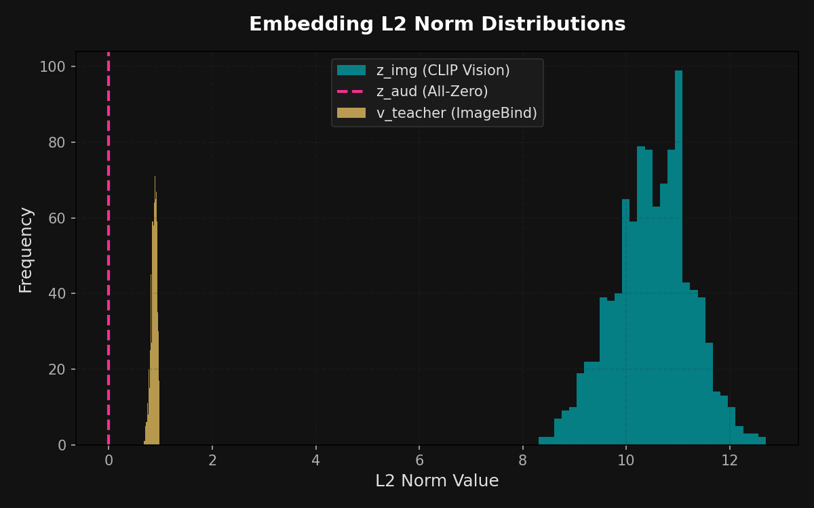
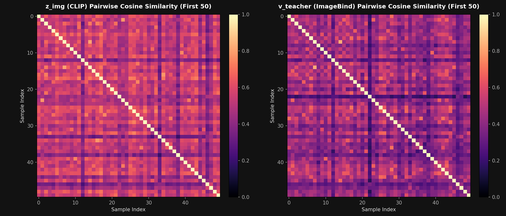
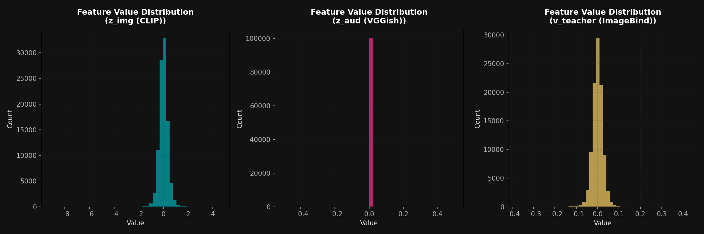
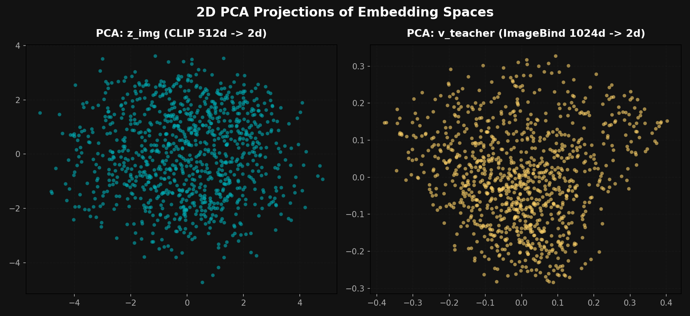

# Multimodal Feature Analysis Report (`test_features.pt`)

This report provides a detailed inspection of the downloaded file `features/test_features.pt`. It outlines the file's contents, encoding formats, distribution statistics, and structural integrity. It also identifies a critical bug in the feature extraction code that causes all audio embeddings to be zero vectors.

---

## 1. Summary of File Contents

The `test_features.pt` file is a serialized PyTorch dictionary containing four main elements:

| Key | Description | Tensor Shape | Data Type | Encoding Details |
| :--- | :--- | :--- | :--- | :--- |
| `z_img` | Student visual frame embedding | `[1000, 512]` | `torch.float16` | Extracted from the **middle frame** of each video using **CLIP (ViT-B/32)**. |
| `z_aud` | Student audio embedding | `[1000, 128]` | `torch.float32` | Extracted using **VGGish**, averaged over the video's audio timeline. |
| `v_teacher` | Teacher video embedding | `[1000, 1024]` | `torch.float32` | Extracted from the **entire video clip** using the vision modality of **ImageBind (huge)**. |
| `video_ids` | Original MSR-VTT video IDs | List of `1000` strings | `str` | Contains IDs mapping to the MSR-VTT test video list (e.g., `'video9012'`). |

---

## 2. Statistical Analysis & Integrity Verification

Our analysis script checked the statistical distributions, L2 norms, and checked for anomalies (NaNs, Infs, or dead representations):

### A. Dimensionality & Format
* **`z_img` (CLIP Student)**: Correctly loaded in `float16` precision (the default output of OpenAI's CLIP model), with a size of 512 dimensions per video.
* **`z_aud` (VGGish Student)**: Correctly loaded in `float32`, but **every single vector is all-zeros (100% ZeroVectors)**. See the critical bug explanation below.
* **`v_teacher` (ImageBind Teacher)**: Correctly loaded in `float32`, with 1024 dimensions per video.

### B. Norm & Scale Distributions
* **`z_img` L2 norms**: $10.50 \pm 0.75$. CLIP embeddings are traditionally unnormalized in raw projection output but clustered in a clean range.
* **`v_teacher` L2 norms**: $0.87 \pm 0.06$. ImageBind embeddings have smaller values and are close to unit scale.
* **`z_aud` L2 norms**: $0.00 \pm 0.00$ (due to the bug).

### C. Embedding Diversity (Within-Modality Self-Similarity)
We calculated the pairwise cosine similarity between all distinct samples in the dataset to evaluate if the embeddings represent a diverse and well-distributed space (i.e., verifying that the representations haven't collapsed):
* **`z_img` (CLIP)**: Mean off-diagonal similarity is **$0.4930 \pm 0.1020$**. This indicates a healthy, diverse vision space.
* **`v_teacher` (ImageBind)**: Mean off-diagonal similarity is **$0.4063 \pm 0.1000$**. This shows clean and spread-out video embeddings.

---

## 3. Visualizations

Here are the visual representations generated from `test_features.pt`:



<!-- slide -->

<!-- slide -->

<!-- slide -->



### Key Observations from the Plots:
1. **L2 Norms**: Visualizes the distinct norm regimes of each model. CLIP outputs are larger ($10.5$), whereas ImageBind is strictly bounded below $1.0$.
2. **Self-Similarity Heatmaps**: The diagonal is a perfect $1.0$ (matching the same video), and the surrounding space is a dark, low-similarity region (around $0.4$). This indicates that each video has a distinct signature and the embeddings are not collapsed.
3. **PCA Projections**: Show that both CLIP (`z_img`) and ImageBind (`v_teacher`) form well-spread, organic clusters in 2D space. The VGGish space is collapsed to a single point at $(0, 0)$ because of the bug.

---

## 4. Critical Bug: Why are the Audio Embeddings All-Zeros?

In `notebooks/1_feature_extraction.ipynb`, the function `extract_vggish_audio` is written with a silent try-except block:

```python
def extract_vggish_audio(video_path):
    import subprocess
    temp_wav = "temp_audio.wav"
    ...
    # Resample to 16kHz mono using ffmpeg
    cmd = f"ffmpeg -y -i {video_path} -vn -acodec pcm_s16le -ar 16000 -ac 1 {temp_wav}"
    subprocess.run(cmd, shell=True, stdout=subprocess.DEVNULL, stderr=subprocess.DEVNULL)
    
    # If no audio track, return zero vector
    if not os.path.exists(temp_wav) or os.path.getsize(temp_wav) < 1000:
        if os.path.exists(temp_wav): os.remove(temp_wav)
        return torch.zeros(128)
        
    try:
        with torch.no_grad():
            feat = vggish.forward(temp_wav)
            if feat.ndim > 1:
                feat = feat.mean(dim=0)
        os.remove(temp_wav)
        return feat.cpu()
    except Exception as e:
        if os.path.exists(temp_wav): os.remove(temp_wav)
        return torch.zeros(128) # <--- SILENT CATCH!
```

### Potential Root Causes:
1. **Missing system dependency**: PyTorch's `soundfile` library relies on the system-level library `libsndfile1` (on Linux / Ubuntu). If `libsndfile1` is not installed on the Kaggle container, calling `vggish.forward(temp_wav)` throws a silent `OSError: sndfile library not found`, causing the exception handler to clean up and return a zero vector.
2. **Missing `ffmpeg` command**: If `ffmpeg` is not in the system path or not installed, the `subprocess.run` command fails to output `temp_audio.wav`, prompting the script to return `torch.zeros(128)` before even running VGGish.
3. **Write Permission / Path conflict**: If multiple processes try to write to `temp_audio.wav` concurrently, conflicts can prevent file generation.

### Recommended Fix:
Update the `extract_vggish_audio` helper on the Kaggle notebook to log the exact exception:
```python
    except Exception as e:
        print(f"Error processing audio for {video_path}: {e}")
        if os.path.exists(temp_wav): os.remove(temp_wav)
        return torch.zeros(128)
```
Additionally, check if `ffmpeg` and `libsndfile` are available in a notebook cell:
```bash
!apt-get install -y ffmpeg libsndfile1
```

---

## 5. Verification Plan: Is this output what we want?

To fully verify that the extracted features are correct, we must check:
1. **Dimension Congruency**: The dimensions are exactly what our model architecture (`src/models.py`) expects. The student MLP concatenates visual (512) and audio (128) to form a `640` dimensional vector, which maps to the `1024` dimensional teacher space.
2. **Audio Activation**: Once the VGGish bug is resolved on Kaggle, the percentage of ZeroVectors in `z_aud` should be small (matching only the few videos that are genuinely silent). The active embeddings should show non-zero variance.
3. **Model Trainability**: The final proof is training the projection MLP. If the loss decreases from $\approx 1.0$ (orthogonal cosine distance) towards $\approx 0.1-0.2$ on both train and validation sets, it confirms the representations are highly aligned and contain structured signal.
