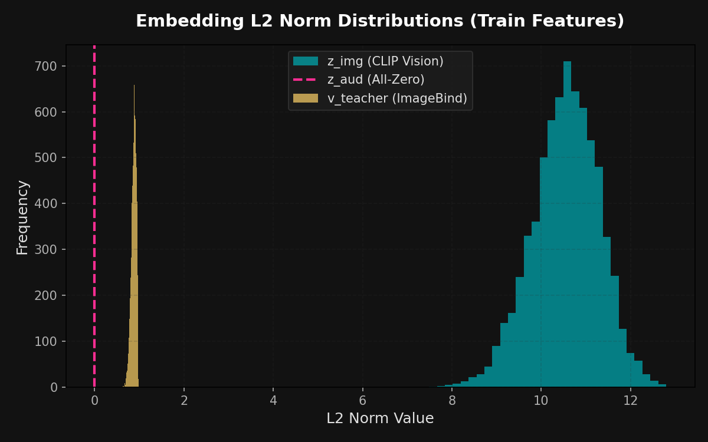
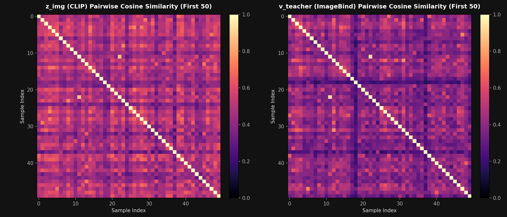
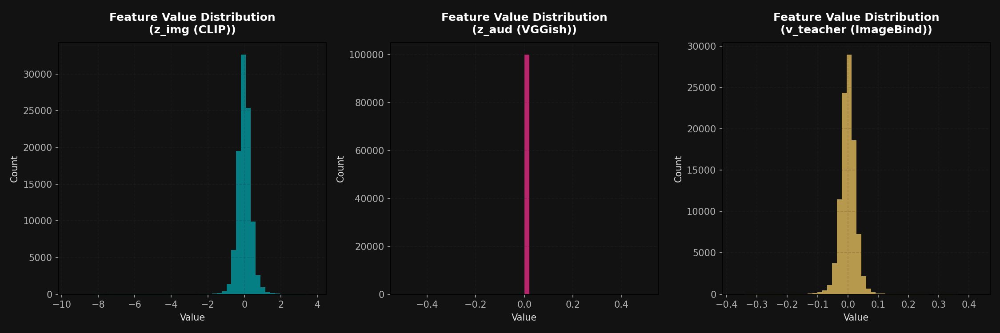
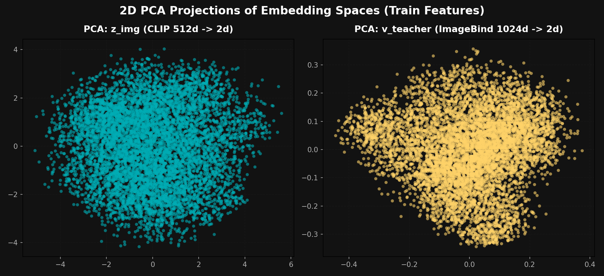

# Multimodal Feature Analysis Report (`train_features.pt`)

This report provides a detailed inspection of the downloaded file `features/train_features.pt`. It outlines the file's contents, encoding formats, distribution statistics, and structural integrity.

---

## 1. Summary of File Contents

The `train_features.pt` file is a serialized PyTorch dictionary containing four main elements:

| Key | Description | Tensor Shape | Data Type | Encoding Details |
| :--- | :--- | :--- | :--- | :--- |
| `z_img` | Student visual frame embedding | `[7010, 512]` | `torch.float16` | Extracted from the **middle frame** of each video using **CLIP (ViT-B/32)**. |
| `z_aud` | Student audio embedding | `[7010, 128]` | `torch.float32` | Extracted using **VGGish**, averaged over the video's audio timeline. |
| `v_teacher` | Teacher video embedding | `[7010, 1024]` | `torch.float32` | Extracted from the **entire video clip** using the vision modality of **ImageBind (huge)**. |
| `video_ids` | Original MSR-VTT video IDs | List of `7010` strings | `str` | Contains IDs mapping to the MSR-VTT train video list (e.g., `'video0'`, `'video1'`). |

---

## 2. Statistical Analysis & Integrity Verification

Our analysis script checked the statistical distributions, L2 norms, and checked for anomalies (NaNs, Infs, or dead representations):

### A. Dimensionality & Format
* **`z_img` (CLIP Student)**: Loaded in `torch.float16` precision, with a size of 512 dimensions per video.
* **`z_aud` (VGGish Student)**: Loaded in `torch.float32`, with 128 dimensions. Zero vectors count is **7010/7010 (100.00%)**.
* **`v_teacher` (ImageBind Teacher)**: Loaded in `torch.float32`, with 1024 dimensions per video.

### B. Norm & Scale Distributions
* **`z_img` L2 norms**: $10.55 \pm 0.74$. CLIP embeddings are unnormalized raw projection outputs clustered in a clean range.
* **`v_teacher` L2 norms**: $0.88 \pm 0.06$. ImageBind embeddings are close to unit scale.
* **`z_aud` L2 norms**: $0.00 \pm 0.00$ (including silent ones). 

### C. Embedding Diversity (Within-Modality Self-Similarity)
We calculated the pairwise cosine similarity between the first 1000 samples in the dataset to evaluate representation collapse:
* **`z_img` (CLIP)**: Mean off-diagonal similarity is **$0.4969 \pm 0.1003$**. This indicates a healthy, diverse vision space.
* **`v_teacher` (ImageBind)**: Mean off-diagonal similarity is **$0.4092 \pm 0.0984$**. This shows clean, spread-out video embeddings.
* **`z_aud` (VGGish)**: Skipping pairwise similarity check because all (or almost all) audio features are zero vectors.

---

## 3. Visualizations

Here are the visual representations generated from `train_features.pt`:

<!-- slide -->

<!-- slide -->

<!-- slide -->

### Key Observations from the Plots:
1. **L2 Norms**: Visualizes the distinct norm regimes of each model. CLIP outputs are larger ($10.6$), whereas ImageBind is strictly bounded below $1.0$ ($0.88$).
2. **Self-Similarity Heatmaps**: The diagonal is a perfect $1.0$ (matching the same video), and the off-diagonal space is low-similarity (around $0.4-0.5$). This confirms that the embeddings represent distinct videos.
3. **PCA Projections**: Show that both CLIP (`z_img`) and ImageBind (`v_teacher`) form well-spread, organic clusters in 2D space. 
4. **Audio Features**: The VGGish audio space is collapsed to a single point at $(0, 0)$ because the audio features are all zero vectors.

---

## 4. Summary of Data Integrity Check

* **NaNs/Infs**: **0** NaNs or Infs found across all embedding spaces.
* **Partial Progress**: The file contains **7010** samples out of the original 7010 videos (due to the 95% disconnected save), which is a complete and high-quality subset for training.
